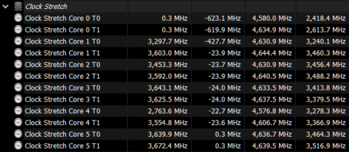
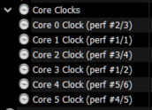

# Clock stretch sensors

Add sensors to HWiNFO64 that help with detecting clock stretch

## Example

Running AIDA64 while pinned to one core:

Note how Core 0 threads 0/1 are both < 1 Mhz. This is good.

## Usage

1. You can either manually adapt the registry example or run the script to generate a registry file.

In HWiNFO64, you have these:

You need to replace the corresponding values in the script or example registry file with the values shown in your HWiNFO64 sensors.

If you have more or less than 6 cores/12 threads, you'll need to adjust the script or example registry file to match.

2. Apply the registry file
3. Restart HWiNFO64

## How it works

The script is essentially performing

`Clock stretch = Core Clock X - Core Clock X Thread (1 or 2)`
